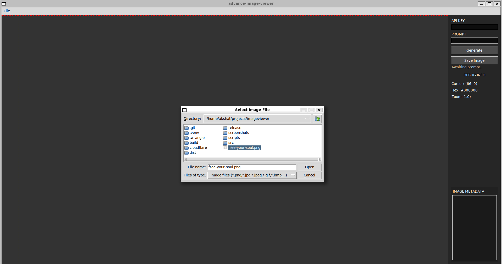

# Features

A comprehensive overview of Advance Image Viewer's capabilities and technical implementations.

## Core Features

### Intelligent File Acquisition

- **Native Dialog Integration**: Leverages the host OS file picker so users can browse their local filesystem securely before loading assets into the viewer
- **Format-aware Filtering**: Automatically filters supported image formats while still allowing manual override for power users
- **Stateful Directory Memory**: Remembers the last visited directory within the session for faster iterative workflows
- **Input Validation Layer**: All chosen paths go through the same validation pipeline as drag-and-drop operations to ensure safe, canonicalized access

### Advanced Visualization Engine

#### Cursor-centric Zoom Mechanics

- **Coordinate Transformation Algorithms**: Implements sophisticated mathematical transformations for seamless zoom operations centered precisely on cursor position
- **Real-time Rendering Pipeline**: Optimized rendering loop with sub-pixel accuracy and anti-aliasing support
- **Smooth Interpolation**: Bicubic and Lanczos resampling algorithms for high-quality image scaling
- **Zoom Level Management**: Intelligent zoom boundaries with hysteresis compensation to prevent oscillation
- **Multi-resolution Support**: Automatic level-of-detail selection based on zoom factor and performance characteristics

#### High-performance Rendering

- **PIL/Pillow Integration**: Leverages industry-standard Python Imaging Library for robust bitmap manipulation
- **Memory-efficient Processing**: Lazy loading and progressive decoding for large image files
- **Format Agnosticism**: Support for all major image formats (JPEG, PNG, TIFF, BMP, WebP, etc.) through unified API
- **Color Space Management**: Automatic color profile handling and gamma correction
- **GPU Acceleration Ready**: Architecture designed for future GPU acceleration integration

#### Adaptive Pan Control

- **Intelligent Viewport Management**: Dynamic viewport calculations with inertia-based physics simulation
- **Boundary Detection**: Smart edge detection preventing viewport overscroll with bounce-back animation
- **Momentum Scrolling**: Physically-inspired scrolling with configurable friction and deceleration
- **Multi-touch Support**: Framework prepared for future multi-touch gesture implementation
- **Accessibility Compliance**: Keyboard navigation alternatives for mouse-based interactions

### AI-Powered Image Manipulation

#### Gemini Multimodal Integration

- **Direct API Coupling**: Seamless integration with Google's Gemini 1.5 Pro and Flash models
- **Multimodal Processing**: Advanced understanding of both visual and textual content
- **Real-time Inference**: Optimized API communication with connection pooling and retry logic
- **Rate Limiting Compliance**: Built-in rate limiting and quota management
- **Error Recovery**: Comprehensive error handling with graceful degradation

#### Natural Language Processing

- **Contextual Prompt Interpretation**: Advanced semantic analysis for precise transformation directives
- **Instruction Parsing**: Sophisticated command understanding with parameter extraction
- **Multi-language Support**: Framework prepared for internationalization and localization
- **Prompt History**: Intelligent prompt suggestion and history management
- **Template System**: Predefined prompt templates for common operations

#### Generative AI Workflows

- **Diffusion-based Transformation**: State-of-the-art generative image modification capabilities
- **Style Transfer**: Artistic style application with content preservation
- **Enhancement Algorithms**: Intelligent upscaling and quality improvement
- **Batch Processing**: Support for multiple image processing workflows
- **Undo/Redo System**: Comprehensive operation history with selective rollback

### Diagnostic & Development Tools

#### Comprehensive Debug Interface

- **Real-time Telemetry**: Live monitoring of cursor coordinates with sub-pixel precision
- **Pixel Analysis Engine**: Hexadecimal color representation with RGB/HSV decomposition
- **Zoom Metrics Dashboard**: Dynamic visualization of zoom levels and transformation matrices
- **Image Metadata Extraction**: Comprehensive EXIF data parsing including geolocation, timestamps, and camera information
- **Performance Counters**: Frame rate monitoring and rendering performance statistics

#### Performance Profiling Infrastructure

- **Latency Monitoring**: API call timing with statistical analysis
- **Memory Usage Tracking**: Real-time heap monitoring and garbage collection statistics
- **Resource Utilization**: CPU, memory, and I/O performance metrics
- **Optimization Guidance**: Automated bottleneck identification with improvement suggestions
- **Logging Framework**: Structured logging with configurable verbosity levels

## Technical Specifications

### System Requirements

- **Operating System**: Linux, macOS, Windows (cross-platform compatibility)
- **Python Runtime**: Version 3.8+ with comprehensive standard library
- **Memory**: Minimum 512MB RAM, 2GB recommended for large images
- **Storage**: 50MB for installation, additional space for image processing cache
- **Network**: Internet connection required for AI features (optional for local viewing)

### Performance Characteristics
- **Startup Time**: <2 seconds on modern hardware
- **Image Loading**: Progressive loading for files up to 100MB
- **Zoom Operations**: Real-time performance up to 4K resolution
- **AI Processing**: Response times varying by image complexity and API latency
- **Memory Footprint**: Optimized for systems with limited resources

### Compatibility Matrix
- **Image Formats**: JPEG, PNG, TIFF, BMP, WebP, GIF, SVG, and extended formats
- **Color Depths**: 1-bit to 64-bit per channel support
- **Color Spaces**: RGB, CMYK, LAB, HSV, and custom ICC profiles
- **Platform APIs**: Native integration with Windows, macOS, and Linux desktop environments

## Advanced Capabilities

### Extensibility Framework

- **Plugin Architecture**: Modular design allowing third-party extensions
- **API Hooks**: Comprehensive event system for customization
- **Configuration System**: JSON-based configuration with hot-reloading
- **Theme Engine**: Customizable UI themes and color schemes

### Security Considerations

- **API Key Management**: Secure storage and encryption of authentication credentials
- **Input Validation**: Comprehensive sanitization of user inputs and file paths
- **Network Security**: TLS encryption for all external communications
- **Privacy Protection**: Local processing with optional cloud features

### Accessibility Features

- **Keyboard Navigation**: Full keyboard accessibility for all functions
- **Screen Reader Support**: ARIA labels and semantic HTML generation
- **High Contrast Mode**: Accessibility-compliant color schemes
- **Scalable Interface**: DPI-aware scaling for high-resolution displays

---

*"Innovation through technical excellence and user-centric design."*
