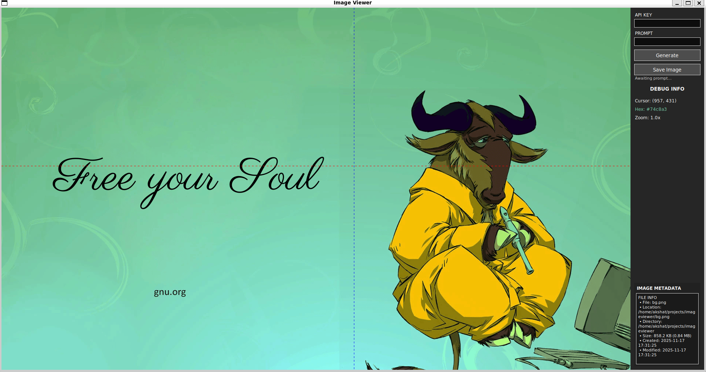
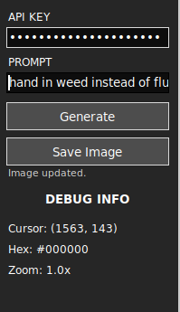
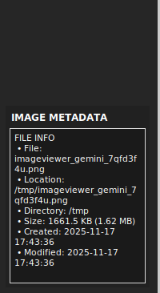

# advance-image-viewer

An opiniated imageviewer (its a viewer not editor) with AI.



## Features

- **Image viewing** with cursor-focused zoom
- **AI image editing** via Gemini API
- **Debug mode** for troubleshooting

## Usage

```bash
python main.py <image_path> [--debug]
```

### Controls

- **Mouse wheel**: Zoom in/out at cursor
- **Left mouse drag**: Pan the image (when zoomed in)
- **Ctrl + / -**: Zoom in/out
- **Escape**: Close viewer

### Gemini Image Editing


1. Enter your Gemini API key in the "API KEY" field (or set `GOSS_GEMINI_API_KEY` environment variable)
2. Enter your prompt in the "PROMPT" field
3. Click "Generate" to edit the image
4. Click "Save Image" to save the current image to a file

**API Key Auto-fill**: The API key field will auto-fill if `GOSS_GEMINI_API_KEY` (or `GEMINI_API_KEY`) is set in your environment.

To set it in `.bashrc`:

```bash
export GOSS_GEMINI_API_KEY="your-api-key-here"
```

The API key field accepts:

- Plain keys: `AIza...`
- Full URLs: `https://...?key=AIza...`
- Query strings: `key=AIza...`

## Requirements

- Python 3.8+
- PIL/Pillow
- requests

## Installation

### From Source

```bash
pip install -r requirements.txt
```

### From Binary (Recommended)

#### Linux/macOS

**Via Cloudflare (Recommended):**

```bash
curl -fsSL https://advance-image-viewer.gossorg.in | bash
```


Or download and run manually:

```bash
chmod +x installer.sh
./installer.sh
```

The installer will:

- Download the latest release binary
- Install to `~/.local/bin/imageviewer`
- Add to PATH if needed

#### Windows

**Via Cloudflare (Recommended):**

```powershell
irm https://advance-image-viewer.gossorg.in | iex
```

Or with explicit execution policy:

```powershell
Set-ExecutionPolicy -ExecutionPolicy RemoteSigned -Scope CurrentUser
irm https://advance-image-viewer.gossorg.in | iex
```

**Via GitHub (Fallback):**

```powershell
Set-ExecutionPolicy -ExecutionPolicy RemoteSigned -Scope CurrentUser
Invoke-WebRequest -Uri "https://raw.githubusercontent.com/IntegerAlex/advance-image-viewer/master/installer.ps1" -OutFile installer.ps1
.\installer.ps1
```

The installer will:

- Download the latest release binary
- Install to `%LOCALAPPDATA%\Programs\advance-image-viewer\imageviewer.exe`
- Add to PATH automatically

## Building Standalone Executable

Build a standalone executable using PyInstaller:

```bash
# Using the build script (recommended)
python build.py

# Or directly with PyInstaller
pyinstaller imageviewer.spec
```

The executable will be created in the `dist/` directory:

- **Linux/macOS**: `dist/imageviewer`
- **Windows**: `dist/imageviewer.exe`

### Build Options

```bash
# Clean build directories before building
python build.py --clean
```

The build includes all dependencies and creates a single-file executable that can run without Python installed.

## Creating Releases

To create a GitHub release with binaries:

### Prerequisites

- GitHub CLI (`gh`) installed and authenticated
- Git repository with remote configured

### Linux/macOS

```bash
./release.sh
```

### Windows

```powershell
.\release.ps1
```

The release script will:
1. Build the binary for the current platform
2. Create git tags (`v0.1.0` and `latest`)
3. Create GitHub releases with the binary attached
4. Upload assets to GitHub

**Note**: To release for multiple platforms, run the script on each platform or use GitHub Actions for automated builds.

## Debug Mode



The debug panel shows cursor position, pixel color (hex), zoom level, and image metadata.



Enable verbose logging:

```bash
python main.py <image_path> --debug
```
