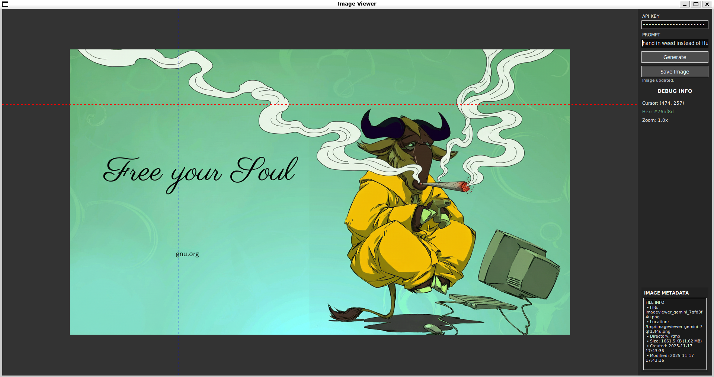

# Image Viewer

A simple image viewer with Gemini AI image editing integration.


## Features

- **Image viewing** with cursor-focused zoom
- **AI image editing** via Gemini API
- **Debug mode** for troubleshooting

## Usage

```bash
python main.py <image_path> [--debug]
```

### Controls

- **Mouse wheel**: Zoom in/out at cursor
- **Left mouse drag**: Pan the image (when zoomed in)
- **Ctrl + / -**: Zoom in/out
- **Escape**: Close viewer

### Gemini Image Editing



1. Enter your Gemini API key in the "API KEY" field (or set `GOSS_GEMINI_API_KEY` environment variable)
2. Enter your prompt in the "PROMPT" field
3. Click "Generate" to edit the image
4. Click "Save Image" to save the current image to a file

**API Key Auto-fill**: The API key field will auto-fill if `GOSS_GEMINI_API_KEY` (or `GEMINI_API_KEY`) is set in your environment.

To set it in `.bashrc`:

```bash
export GOSS_GEMINI_API_KEY="your-api-key-here"
```

The API key field accepts:

- Plain keys: `AIza...`
- Full URLs: `https://...?key=AIza...`
- Query strings: `key=AIza...`

## Requirements

- Python 3.8+
- PIL/Pillow
- requests

## Installation

```bash
pip install -r requirements.txt
```

## Debug Mode


The debug panel shows cursor position, pixel color (hex), zoom level, and image metadata.


Enable verbose logging:

```bash
python main.py <image_path> --debug
```